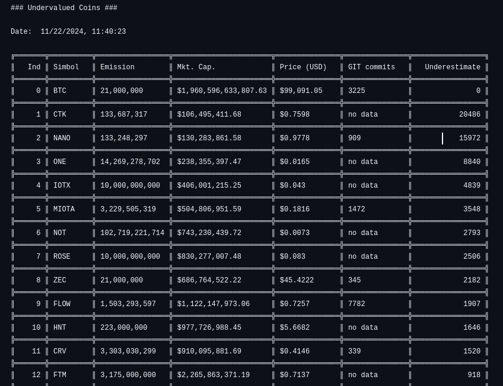

# Analysis of cryptocurrency undervaluation

This service was created to analyze the undervaluation of cryptocurrency relative to the BTC price and issue. The maximum coin supply is included in the calculation, if one is preset. If there is no maximum emission, then total supply is used.

## How to use
To use the service, you need to create a **.env** file at root directory. It must contain the api token (https://min-api.cryptocompare.com/). And github tokens.
```bash
API_TOKEN = "your_token"
GITHUB_TOKEN = "your_token"
```
And run

```bash
$ python ./main.py
```
or (to write to a file)
```bash
$ python ./main.py >> stack
```

Coin statistics will be displayed. Based on these statistics, we can conclude that the price of the coin is objective.
GIT commits - count of commits in the last year.



## Сalculation algorithm
The calculation algorithm is very simple, and this is my personal opinion.
```bash
(BTC_PRICE / (CURRENCY_SUPPLY / BTC_SUPPLY)) / CURRENCY_PRICE
```
Thus, we first calculate how much BTC would be worth if its emission were equal to the emission of the selected coin. Next, we divide this amount by the current price of the coin and get how many times the coin is cheaper than BTC. Personally, it helps me understand how much the coin is relatively cheaper than BTC.

## TODO
- Add an interface for analyzing one coin. Pass the coin code via a command line argument.

## Denial of responsibility
This service does not constitute financial advice or investment insight. If you use it, YOU and YOU ONLY are responsible for it.

The code for this service is posted for informational purposes.