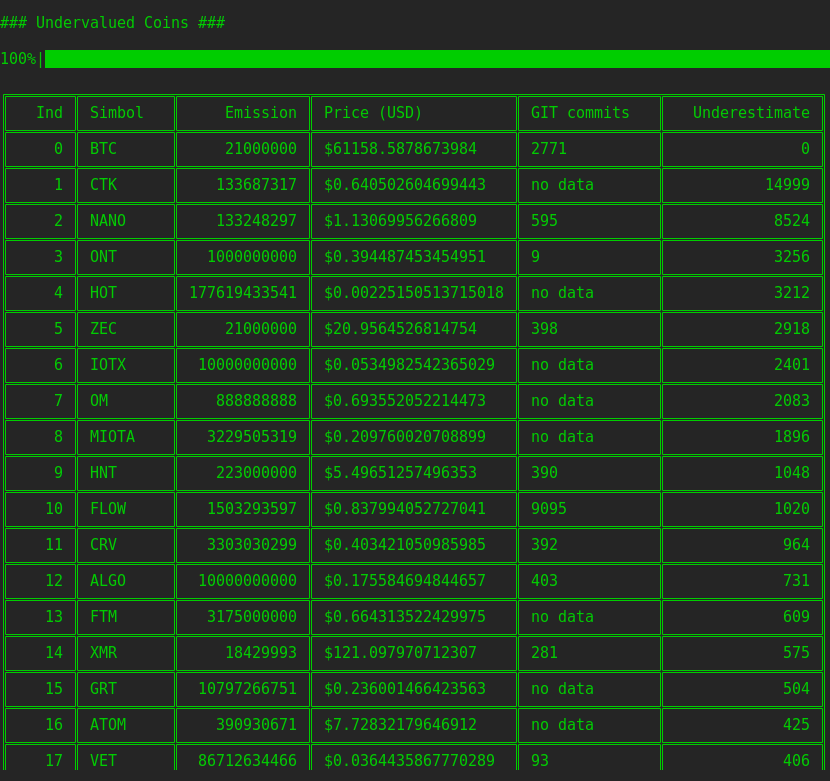

# Analysis of cryptocurrency undervaluation

This service was created to analyze the undervaluation of cryptocurrency relative to the BTC price and issue. The maximum coin supply is included in the calculation, if one is preset. If there is no maximum emission, then total supply is used.

## How to use
To use the service, you need to create a **.env** file at root directory. It must contain the api token (https://min-api.cryptocompare.com/)
```bash
API_TOKEN = "your_token"
```
And run

```bash
$ python ./main.py
```




## Сalculation algorithm
The calculation algorithm is very simple, and this is my personal opinion.
```bash
(BTC_PRICE / (CURRENCY_SUPPLY / BTC_SUPPLY)) / CURRENCY_PRICE
```
Thus, we first calculate how much BTC would be worth if its emission were equal to the emission of the selected coin. Next, we divide this amount by the current price of the coin and get how many times the coin is cheaper than BTC. Personally, it helps me understand how much the coin is relatively cheaper than BTC.

## TODO
I plan to add an analysis of the repositories of those coins that participate in the analysis. This will help you understand what growth potential the selected project has.

## Отказ от ответственности
Данный сервис не является финансовым советом или инсайдом для инвестиций. Если вы его используете, ВЫ и ТОЛЬКО ВЫ САМИ несете за это отвественность. 

Код данного сервиса выложен в ознокомительных целях.
